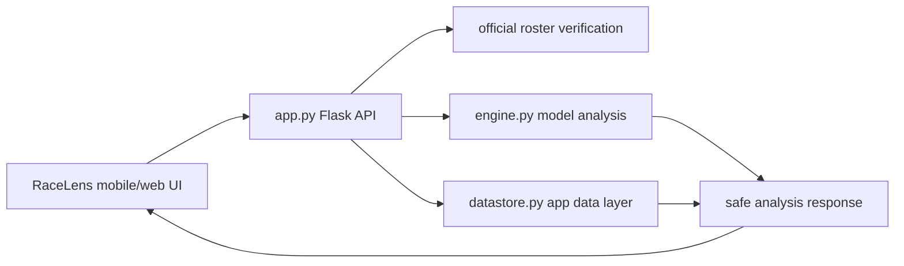

# RaceLens Learning Guide

## 1. Product Shape

RaceLens is a 경륜·경마 데이터 분석 project. It combines a Flask API, model analysis code, a persistence layer for app sessions and audit events, and an Expo mobile app prepared for store review.

The product does not frame model output as betting advice. User-facing language should describe data source state, official roster verification, probability analysis, and uncertainty.

## 2. Request Flow



## 3. Main Files

- `app.py`: API routes, legal pages, CORS policy, roster gate, UX event ingestion.
- `engine.py`: 경륜·경마 model analysis and market data handling.
- `datastore.py`: user/session quota, subscription state, prediction snapshots, anonymous UX events.
- `templates/index.html`: legal-domain root web UI seen by reviewers.
- `mobile/`: Expo app, release QA scripts, store readiness checks.
- `tests/test_app_data_layer.py`: backend policy and data-layer regression tests.

## 4. Verification Order

```bash
.venv\Scripts\python.exe -m pytest tests/test_app_data_layer.py -q
cd mobile
npm run typecheck
npm run qa:mobile
```

For store work, continue with API-failure, analytics, release-visual, store-readiness, and submission gates.

## 5. Safety Rules

- Do not expose participant, odds, or prediction order until official roster verification allows it.
- Do not add purchase pressure, guaranteed outcome language, or revenue claims.
- Keep the average -EV and responsible-use notice in public documentation.
- Keep production CORS fail-closed unless `RACELENS_ALLOWED_ORIGINS` is configured.
