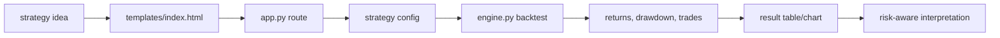
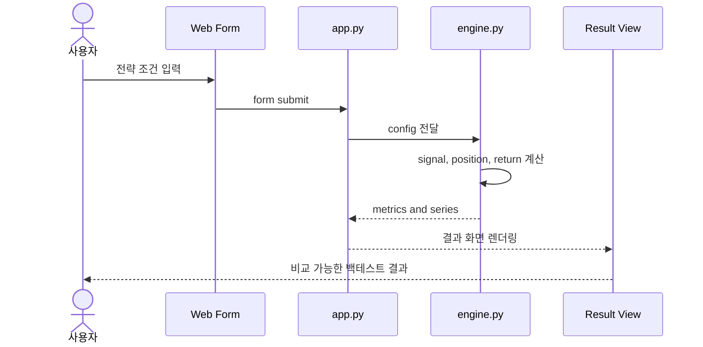

# Strategy Arena Learning Guide

## 1. 문제 정의

전략 아이디어를 규칙과 파라미터로 표현하고, 과거 데이터 기준으로 실험 결과를 비교해 투자 조언이 아닌 검증 가능한 백테스트 학습 자료로 만드는 프로젝트입니다.

## 2. 프로젝트 유형

- 유형: 웹 UI + 백테스트 엔진 + 금융 실험 검증
- 핵심 역량: Python 시뮬레이션, 금융 데이터 해석, 실험 설계, 리스크-aware 커뮤니케이션

## 3. 프로젝트 맞춤형 상호작용 구조 시각화

### 상호작용 표

| 트리거/행동 | 입력/상태 | 처리 컴포넌트 | 데이터/모델/외부 접점 | 출력/산출물 | 검증 신호 | 실패/예외 처리 |
|---|---|---|---|---|---|---|
| 전략 파라미터 입력 | UI form values | `app.py` route | request form data | normalized config | config fields 존재 | 누락/잘못된 값 기본 처리 |
| 백테스트 실행 | strategy config | `engine.py` simulation | price series, strategy rules | equity/result metrics | result table, chart values | 빈 데이터/계산 오류 표시 |
| 결과 비교 | 여러 전략 결과 | engine aggregation | returns, drawdown, win/loss | 비교 화면 | metrics consistency | 과대해석 방지 문구 |
| 로컬 실행 | `python app.py` | Flask app | templates | local web UI | browser page opens | dependency 오류 안내 |

### 백테스트 흐름



### 요청/처리 시퀀스



## 4. 아키텍처

- `app.py`: 웹 요청과 화면 렌더링
- `engine.py`: 전략 구성, 시뮬레이션, 결과 계산
- `templates/`: 전략 입력과 결과 확인 UI
- `START_HERE.txt`: 로컬 사용 흐름

## 5. 데이터 흐름

```text
strategy idea -> form config -> simulation engine -> metrics -> result UI -> risk-aware review
```

## 6. 핵심 코드 해부 순서

1. `app.py`: 사용자 입력이 어떤 함수로 전달되는지 봅니다.
2. `engine.py`: 전략 규칙이 어떻게 수익률과 지표로 바뀌는지 봅니다.
3. `templates/index.html`: 어떤 입력값이 실제 실험 조건인지 확인합니다.

## 7. 설계 이유와 대안

- 단일 Flask app: 백테스트 흐름을 빠르게 시연하기 좋습니다.
- 별도 엔진 파일: UI와 전략 계산을 분리해 면접에서 책임 분리를 설명하기 쉽습니다.
- 대안: Jupyter notebook은 분석에는 좋지만 사용자 입력형 제품 시연에는 약합니다.

## 8. 테스트/검증

```bash
python -m pip install -r requirements.txt
python app.py
```

브라우저에서 전략 입력 후 결과 테이블이 생성되는지 확인합니다.

## 9. 취약점/개선점

- transaction cost, slippage, walk-forward split을 더 명시해야 합니다.
- 결과를 CSV로 저장하고 실험 로그를 남기면 재현성이 좋아집니다.
- 데이터 품질 검증이 추가되면 금융권 데이터 직무 신호가 강해집니다.

## 10. 직접 해볼 변형 과제

1. `engine.py`에 drawdown 계산을 하나 추가합니다.
2. 결과 화면에 assumption note를 추가합니다.
3. README에 "백테스트 결과를 투자 조언으로 해석하면 안 되는 이유"를 자기 말로 씁니다.

## 11. 면접 대비

### 30초 설명

Strategy Arena는 전략 아이디어를 입력하고 백테스트 결과를 비교하는 Flask 기반 금융 실험 도구입니다. 핵심은 수익률 주장보다 실험 조건과 리스크 해석을 명확히 하는 것입니다.

### 2분 설명

이 프로젝트는 금융 데이터 분석과 실험 검증 습관을 보여주기 위한 백테스트 도구입니다. 사용자가 전략 조건을 입력하면 Flask route가 설정값을 받아 `engine.py`에 전달하고, 엔진은 signal, position, return, result metrics를 계산합니다. 결과는 웹 화면에 표시되며, 실제 투자 조언이 아니라 전략 아이디어를 검토하는 증거로만 사용한다는 제한을 README에 명시했습니다.
