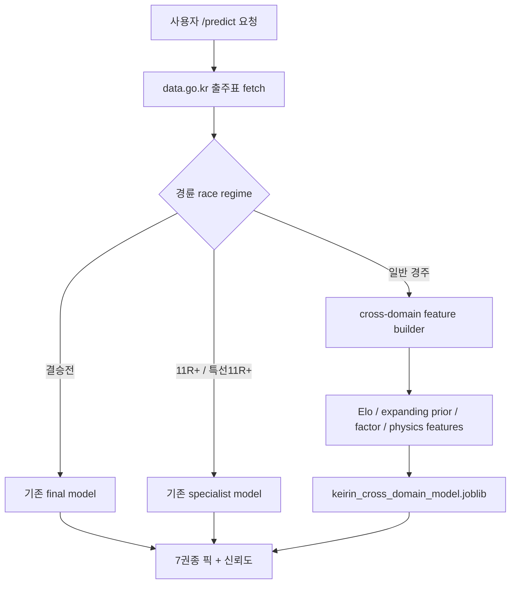

# 경륜 교차분야 예측 업그레이드

실행일: 2026-06-30

목표는 주식·코인·물리·그래프·수학적 랭킹에서 쓰는 패턴을 경륜 출주표 예측에 이식해, 기존 전체 기준선을 OOS에서 실제로 넘는 후보를 찾는 것이다.

## 적용한 아이디어

| 계열 | 경륜 적용 방식 |
|---|---|
| 주식·코인 모멘텀 | 최근 순위 변화량, 가속도, 변동성, 휴식일, 선수 expanding 승률 |
| 리스크/팩터 모델 | 경주 내 z-score, percentile, field entropy, concentration |
| 물리/피로 | 200m 기록 정규화, 기어×속도, 나이 비선형, fatigue load |
| 그래프·랭킹 | 과거 같은 경주 상대 순서 기반 Elo prior |
| 조합 모델 | 위 feature 전부를 `all_cross_domain`으로 결합 |

## OOS 결과

검증: `/Users/tttksj/keirin/cross_domain_sweep.py`, train `stnd_yr<=2020`, test `stnd_yr>=2021`, paired bootstrap by race.

| method | top1 | Δtop1 | p_not_better | plc | Δplc | p_not_better_plc | verdict |
|---|---:|---:|---:|---:|---:|---:|---|
| baseline | 0.6011 | +0.00pp | 1.000 | 0.7728 | +0.00pp | 1.000 | 기준선 |
| finance_momentum | 0.6039 | +0.28pp | 0.100 | 0.7745 | +0.17pp | 0.190 | 탈락 |
| physics_fatigue | 0.6016 | +0.05pp | 0.365 | 0.7721 | -0.08pp | 0.722 | 탈락 |
| graph_elo | 0.6154 | +1.42pp | 0.000 | 0.7835 | +1.07pp | 0.000 | 통과 |
| factor_entropy | 0.6060 | +0.48pp | 0.013 | 0.7759 | +0.31pp | 0.045 | 보조 통과 |
| all_cross_domain | 0.6162 | +1.51pp | 0.000 | 0.7833 | +1.05pp | 0.000 | 채택 |

## 연도별 안정성

| year | baseline top1 | graph_elo top1 | all_cross_domain top1 | baseline plc | graph_elo plc | all_cross_domain plc |
|---:|---:|---:|---:|---:|---:|---:|
| 2021 | 0.6303 | 0.6366 | 0.6391 | 0.8195 | 0.8195 | 0.8221 |
| 2022 | 0.6038 | 0.6067 | 0.6180 | 0.7824 | 0.7849 | 0.7898 |
| 2023 | 0.6175 | 0.6233 | 0.6267 | 0.7850 | 0.7908 | 0.7888 |
| 2024 | 0.5958 | 0.6134 | 0.6114 | 0.7700 | 0.7772 | 0.7804 |
| 2025 | 0.5819 | 0.6105 | 0.6097 | 0.7456 | 0.7649 | 0.7673 |

## 고확신 선별 정책

추가 검증: `/Users/tttksj/keirin/selective_confidence_sweep.py`.

방법은 전체 경주를 모두 예측하지 않고, 2019-2020 검증구간에서 rule을 먼저 고른 뒤 2021+ OOS에 고정 적용했다. 따라서 아래 수치는 전체 경주 적중률이 아니라 `coverage`만큼의 선별 경주 top1이다.

| selected rule | validation top1 | validation coverage | 2021+ OOS top1 | 2021+ OOS coverage | test races |
|---|---:|---:|---:|---:|---:|
| `top_pwin >= 60.7%` | 0.7642 | 0.500 | 0.7287 | 0.5619 | 6,627 |
| `top_pplc >= 90.7%` | 0.8601 | 0.203 | 0.8175 | 0.2765 | 3,261 |
| `top1-top2 win gap >= 56.5%p` | 0.8564 | 0.210 | 0.8214 | 0.3029 | 3,572 |
| `top1-top2 win gap >= 63.7%p` | 0.8886 | 0.140 | 0.8467 | 0.2168 | 2,557 |

앱 표시는 다음처럼 분리한다.

- 전체 일반 예측: OOS top1 약 61.6%.
- 73%급 고확신 선별: top candidate의 `pwin >= 60.7%`.
- 82%급 고확신 확장: top1과 top2의 win gap이 56.5%p 이상.
- 85%급 초고확신 선별: top1과 top2의 win gap이 63.7%p 이상.

## 배포 적용

생성 artifact:

- `static/models/keirin_cross_domain_model.joblib`

엔진 적용:

- 일반 경륜 fallback에서 `keirin_cross_domain_model.joblib`를 우선 사용한다.
- 결승전, 11R+, 특선 11R+ 특화 모델 라우팅은 기존대로 유지한다.
- 새 모델은 출주표 단일 경주에서 계산 가능한 feature와 artifact 안의 과거 선수 prior/Elo map만 사용한다.
- 일반 cross-domain 경륜 모델에는 고확신 선별 tier를 추가한다. 이 tier는 적중 보장이 아니라 검증구간에서 고른 threshold가 OOS에서 보인 과거 성능 표시다.

## 운영 판단

- 전체 경주 기준으로 `all_cross_domain`은 top1 +1.51pp, 연대 +1.05pp로 기존 일반 모델을 넘었다.
- 극 개선은 전체 강제 예측이 아니라 선별 정책에서 나온다. 가장 강한 tier는 coverage 21.7%에서 OOS top1 84.67%였고, coverage 30.3%까지 넓힌 tier도 OOS top1 82.14%였다.
- 이 결과는 적중률 개선이지 +EV 보장이 아니다.
- 다음 검증은 live 배당 블렌딩과 충돌 여부, 결승/11R specialist 대비 router 재평가다.
