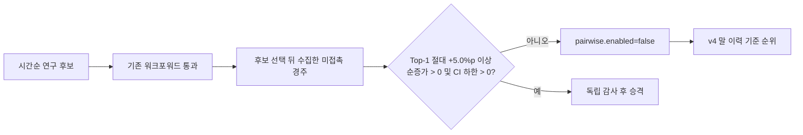

# KRA fresh-holdout promotion guard

## 최종 배포 결정

2026-07-17에 공식 data.go.kr 결과 API로 2026-06-22 이후 151경주를 다시 검증했다. 이 구간은 v5 및 후속 다중 뷰 후보를 고르는 과정에서 사용되지 않은 미접촉 검증 구간이다.

| 정책 | 경주 | top-1 | top-3 | log-loss |
|---|---:|---:|---:|---:|
| v4 말 이력 기준 모델 | 151 | 32.45% | 62.25% | 1.8931 |
| v5 제한 pairwise | 151 | 32.45% | 62.25% | 1.8929 |

v5는 v4와 같은 top-1이었다. paired bootstrap 95% 구간은 `-2.649~+2.649%p`, 개선 확률은 40.04%로 0을 포함한다. 따라서 v5 pairwise는 production에서 비활성화하고 v4 순위를 유지한다.

## 추가 탐색 결과

- 임계값 제한, ExtraTrees, RandomForest, 착순 pairwise, hard-negative pairwise는 v5보다 약하거나 유의하지 않아 기각했다.
- 제한 pairwise의 최신 미접촉 홀드아웃 결과는 v4 대비 `0.000%p`다. 절대 `+5.0%p`에 못 미치고 신뢰구간이 0을 포함하므로 실패다.
- 최근·거리·경마장 모델과 pairwise 결합은 기존 관찰 구간에서 v4 대비 `+0.976%p`였지만 절대 `+5.0%p`에 못 미치고 v5 대비 95% 신뢰구간도 0을 포함해 기각한다.
- 기수 감량·마구·마주 이력을 포함한 다중 뷰 후보도 기존 구간에서 강했지만 새 미접촉 151경주에서 v4를 넘지 못해 승격하지 않았다.

현재 모델은 새 결과까지 재학습했으며 `kra_dual_phase_v4_history_fresh_holdout_guard`로 식별된다. 2026 전체 1,323경주에서는 top-1 `29.48%`, top-3 `62.06%`; 사전 고확신 구간은 coverage `33.11%`에서 top-1 `36.99%`다. 최신 완전 배당판 경로는 top-1 `38.25%`, 고확신 coverage `28.27%`에서 `52.94%`다.

재현 명령은 `.venv/bin/python tools/kra_fresh_holdout_guard.py --from 20260622`다. 후보는 현재 production v4 대비 미접촉 OOS top-1이 절대 `+5.0%p` 이상이고, 순증가와 bootstrap 신뢰구간 하한이 모두 양수일 때만 승격 대상이 된다. top-3 또는 log-loss를 바꾸는 후보는 해당 지표도 비악화여야 한다. 현재 확인된 후보 중 이 기준을 충족한 것은 없으며 자동 비활성 상태를 유지한다. 이는 적중률 검증이며 수익률 또는 +EV 근거가 아니다.
