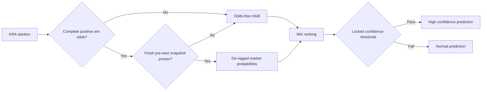

# KRA prediction v3

## Result

The horse model now separates information available before odds from information available after a complete positive win-odds board arrives. The previous artifact was trained with odds but also used when odds were absent, which created a train/serve distribution shift.

The production artifact contains the odds-free win/place models, the validation-selected live market weight, and both confidence thresholds. Horse participant-learning overlays stay disabled because their recorded OOS validation has only 14 matched races and marks the candidate non-deployable.

## Evaluation contract

- Development: races before 2025-01-01.
- Model and live-weight selection: 2025 races only.
- Locked holdout: 1,189 races from 2026-01-01 through 2026-06-21.
- Metrics: race-level top-1, top-3, winner log-loss, and race bootstrap where rankings differ.
- Odds are excluded from the pre-race model. Live routing requires valid positive odds for every starter and explicit `odds_snapshot_fresh=true` provenance.
- The experiment is reproducible with `python tools/kra_dual_phase_experiment.py`.

## Locked-holdout evidence

| mode | policy | top-1 | top-3 | coverage |
|---|---|---:|---:|---:|
| old pre-race | odds-trained model with zero odds | 19.34% | 46.85% | 100% |
| v3 pre-race | odds-free HGB | 24.31% | 56.94% | 100% |
| v3 pre-race selective | top probability at least 0.2540 | 32.08% | - | 31.20% |
| v3 live | de-vigged complete odds board | 38.10% | 70.98% | 100% |
| v3 live selective | top probability at least 0.4415 | 51.88% | - | 29.02% |

The result is an accuracy and calibration improvement, not evidence of positive betting return. Prior KRA ROI gates remain negative, so the UI must not describe v3 as a profitable betting system.
