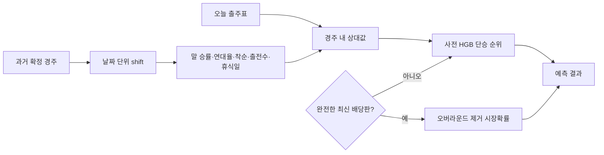

# KRA prediction v4

## 결과

사전 예측 모델에 말 자체의 과거 전적을 날짜 단위로 지연시켜 추가했다. 같은 날 결과와 미래 결과는 어떤 피처에도 들어가지 않는다. 기존 배당 없는 v3 특성, 말 이력 추가 후보, 연승 모델 선두를 단승 후보로 역사용하는 후보를 네 개의 시간순 구간에서 다시 비교했다.

## 워크포워드 검증

| 평가 구간 | 기존 사전 top-1 | 말 이력 top-1 | 개선 | 기존 top-3 | 말 이력 top-3 |
|---|---:|---:|---:|---:|---:|
| 2024 하반기 | 22.15% | 24.86% | +2.71%p | 53.49% | 57.59% |
| 2025 상반기 | 25.14% | 29.90% | +4.75%p | 57.13% | 58.82% |
| 2025 하반기 | 25.82% | 29.77% | +3.95%p | 57.15% | 62.01% |
| 2026 상반기 | 24.05% | 29.27% | +5.21%p | 57.44% | 61.82% |

전체 4,865경주의 paired bootstrap top-1 개선은 +4.15%p, 95% 신뢰구간은 +3.04~+5.28%p다. 말 이력을 포함한 연승 선두 역사용은 단승 모델 대비 +0.21%p였지만 95% 신뢰구간 -0.68~+1.09%p로 0을 포함해 배포하지 않았다.

## 2026 시간 평가

| 정책 | top-1 | top-3 | winner log-loss | coverage |
|---|---:|---:|---:|---:|
| 이전 배당 학습 모델에 배당 0 입력 | 18.92% | 46.51% | 2.2815 | 100% |
| v4 말 이력 사전 모델 | 29.27% | 61.82% | 1.9713 | 100% |
| v4 사전 고확신 선별 | 36.25% | 미주장 | 미주장 | 32.72% |
| 최신 완전 배당 시장확률 | 38.10% | 70.98% | 1.7702 | 100% |
| 최신 배당 고확신 선별 | 51.88% | 미주장 | 미주장 | 29.02% |

2026 구간은 앞선 연구에서 이미 관찰됐으므로 새 미접촉 홀드아웃이라고 부르지 않는다. 승격 근거는 네 시간순 구간의 일관된 개선과 전체 paired bootstrap 신뢰구간이다. 이 결과는 순위 적중률 개선이며 수익률 또는 +EV 증거가 아니다.

재현 명령은 `python tools/kra_reverse_candidate_audit.py`와 `python tools/kra_dual_phase_experiment.py --save-model static/models/kra_model.joblib`이다.
