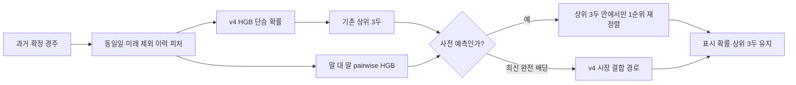

# KRA prediction v5

> 배포 상태: **비활성화**. 2026-06-22 이후 새로 수집한 미접촉 134경주에서 v4보다 top-1이 2경주 낮아져 production artifact의 `pairwise.enabled`를 `false`로 고정했다. 현재 승격 하한은 production 대비 OOS top-1 절대 `+5.0%p`이며, 아래 수치는 이 기준에 못 미친 연구 기록이다.

## 결과

v4의 날짜 안전 말 이력 확률은 그대로 유지하고, 사전 예측의 기존 상위 3두 안에서만 pairwise 모델이 단승 1순위를 제한적으로 재정렬한다. 상위 3두 구성, 표시 확률, top-3 적중률, log-loss는 바꾸지 않는다. 최신 완전 배당판이 확인된 live 단계에는 재정렬기를 적용하지 않는다.

## 시간순 워크포워드 검증

각 구간은 그 이전 데이터로만 학습했다. 후보 선택 기준은 2024 하반기부터 2025 하반기까지의 최소 개선과 평균 개선이며, 2026 상반기 결과는 마지막 확인 구간으로 분리했다. 2026 데이터는 이전 연구에서도 관찰됐으므로 완전히 미접촉한 홀드아웃이라고 주장하지 않는다.

| 평가 구간 | v4 대비 top-1 개선 | top-3 변화 | log-loss 변화 | 재정렬 비율 |
|---|---:|---:|---:|---:|
| 2024 하반기 | +0.328%p | 0.000%p | 0.0000 | 4.18% |
| 2025 상반기 | +0.725%p | 0.000%p | 0.0000 | 4.59% |
| 2025 하반기 | +0.329%p | 0.000%p | 0.0000 | 3.54% |
| 2026 상반기 | +0.841%p | 0.000%p | 0.0000 | 3.95% |

최신 데이터 재실행 기준 전체 구간의 paired bootstrap top-1 개선은 `+0.549%p`, 95% 신뢰구간은 `+0.203~+0.895%p`다. 통계적으로 양수여도 절대 승격 하한 `+5.0%p`의 약 11%에 불과하므로 실패다. 네 구간의 top-3와 확률 기반 log-loss는 설계상 동일하다.

## 2026 해석

| 정책 | top-1 | top-3 | winner log-loss |
|---|---:|---:|---:|
| v4 말 이력 사전 모델 | 29.27% | 61.82% | 1.9713 |
| v5 제한 pairwise 재정렬 | 약 30.11% | 61.82% | 1.9713 |

기능 스모크에서는 `서울|20260621|8` 경주에서 기존 확률 선두 11번 대신 기존 top-3 안의 1번이 v5 단승 선두로 재정렬됐고, 알고리즘 버전과 사전 단계 경로가 정상 노출됐다. 이 스모크는 배포 동작 확인일 뿐 성능 근거로 사용하지 않는다.

## 탐색한 후보와 기각 기준

- 최근 폼·거리·경마장·기수 결합 피처: 첫 구간 top-3 저하 및 pooled 신뢰구간이 0을 포함해 기각했다.
- HGB·ExtraTrees·RandomForest·앙상블: 일부 top-1 개선은 있었지만 top-3 또는 신뢰구간 게이트를 통과하지 못했다.
- 무제한 pairwise 순위: top-1은 개선됐으나 2025 하반기 top-3와 log-loss가 악화돼 기각했다.
- 기존 top-3 내부 제한 pairwise: 초기 워크포워드 게이트는 통과했지만 이후 미접촉 홀드아웃에서 실패해 배포에서 제외했다.

이 결과는 순위 적중률 개선이며 수익률 또는 +EV 증거가 아니다. 재현 명령은 `.venv/bin/python tools/kra_pairwise_rerank_search_v5.py`와 `.venv/bin/python tools/validate_kra_autoresearch.py --report runs/kra_pairwise_rerank_v5_results.json --completion .omx/specs/autoresearch-kra-v5/result.json`이다.
